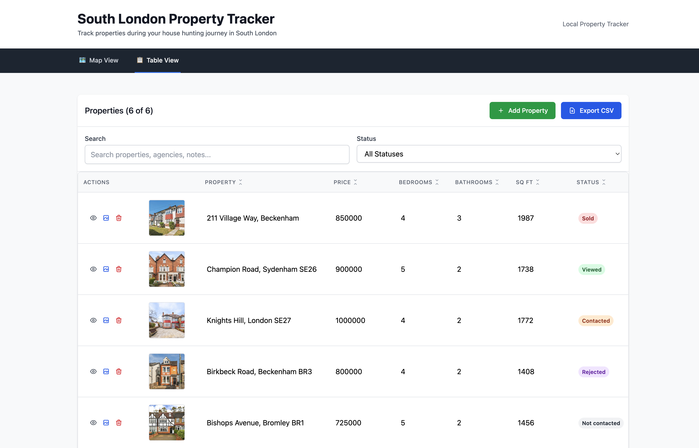
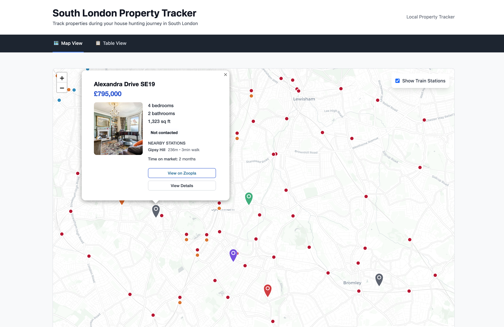

# South London Property Tracker

A local web application for tracking properties during house hunting in South London. The app displays properties on an interactive map with table views and data management capabilities.

## Features

- **Interactive Map**: View properties on a map with custom markers showing status
- **Property Management**: Add, edit, and track properties with detailed information
- **Image Support**: Upload and manage property images
- **Filtering & Search**: Filter properties by status, price, bedrooms, and more
- **Data Export**: Export your property data as CSV or JSON
- **Local Storage**: All data stored locally in SQLite database

## Screenshots

### Table View


_The table view shows all properties in a sortable, filterable table format with search functionality and status indicators._

### Map View


_The map view displays properties as interactive markers on a map of South London, with detailed property cards and train station overlays._

## Tech Stack

- **Frontend**: React with TypeScript, Tailwind CSS, Leaflet.js
- **Backend**: Node.js with Express and TypeScript
- **Database**: SQLite with better-sqlite3
- **Build Tools**: Vite (client), TypeScript (server)

## Getting Started

### Prerequisites

- Node.js (v18 or higher)
- npm

### Installation

1. Clone the repository:

   ```bash
   git clone <repository-url>
   cd hunter
   ```

2. Install dependencies for all packages:
   ```bash
   npm install
   cd client && npm install
   cd ../server && npm install
   cd ..
   ```

### Development

Start both the client and server in development mode:

```bash
npm run dev
```

This will start:

- **Client**: http://localhost:5173 (Vite dev server)
- **Server**: http://localhost:3001 (Express API server)

You can also run them separately:

```bash
# Client only
npm run dev:client

# Server only
npm run dev:server
```

### Building for Production

```bash
npm run build
```

This builds both the client and server. The built files will be in:

- `client/dist/` - Client build
- `server/dist/` - Server build

### Running Production Build

```bash
npm start
```

## Project Structure

```
hunter/
├── client/                 # React frontend
│   ├── src/
│   │   ├── components/     # React components
│   │   ├── types/         # TypeScript type definitions
│   │   ├── utils/         # Utility functions
│   │   └── App.tsx        # Main app component
│   └── package.json
├── server/                # Express backend
│   ├── src/
│   │   ├── routes/        # API routes
│   │   ├── database/      # Database connection and schema
│   │   └── server.ts      # Main server file
│   └── package.json
├── data/                  # Local data storage
│   ├── properties.db      # SQLite database
│   └── images/           # Property images
├── planning/             # Project planning documents
└── package.json          # Root package.json with scripts
```

## API Endpoints

- `GET /api/health` - Health check
- `GET /api/properties` - List all properties
- `POST /api/properties` - Create new property
- `PUT /api/properties/:id` - Update property
- `DELETE /api/properties/:id` - Delete property
- `GET /api/properties/:id` - Get single property

## Data Management

### Database

The application uses SQLite for local data storage. The database file is created automatically at `data/properties.db` when you first run the server.

### Images

Property images are stored in the `data/images/` directory and served by the API server.

### Backup & Restore

You can export your data as JSON and import it later using the API endpoints:

- `GET /api/export` - Export all data
- `POST /api/import` - Import data

## Development Notes

- The client and server run on different ports to avoid conflicts
- CORS is configured to allow the client to communicate with the server
- TypeScript is used throughout for type safety
- ESLint and Prettier are configured for consistent code formatting

## License

ISC
